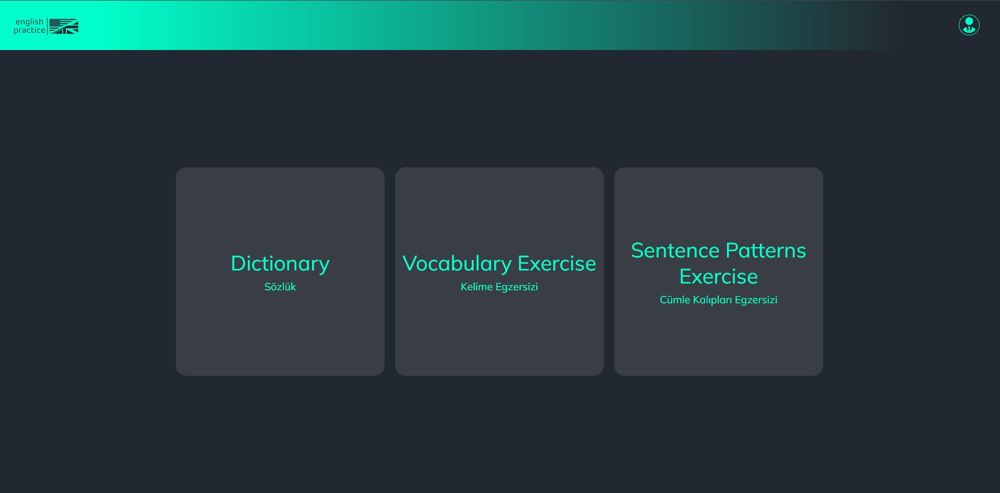
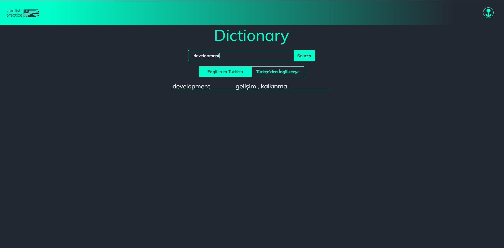
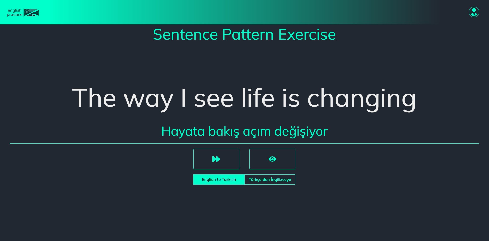
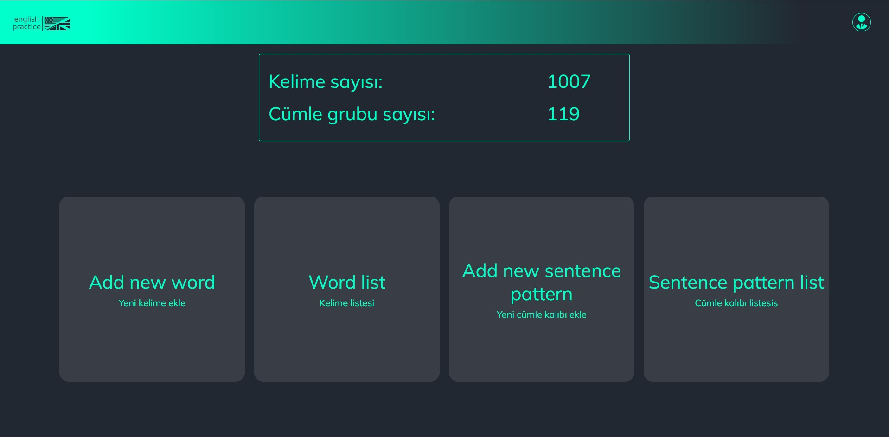
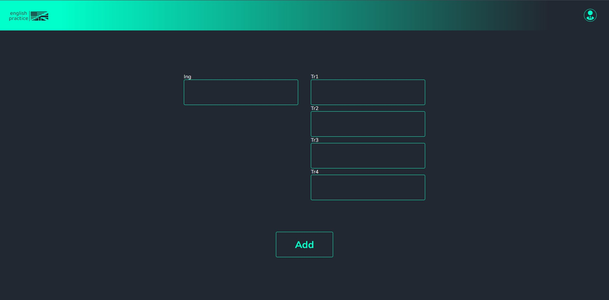
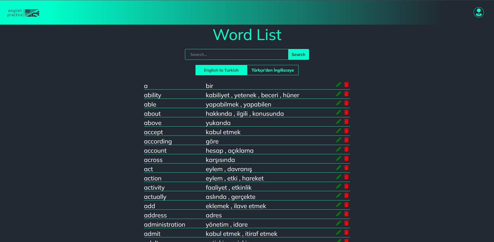
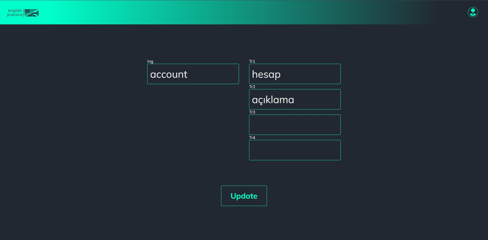
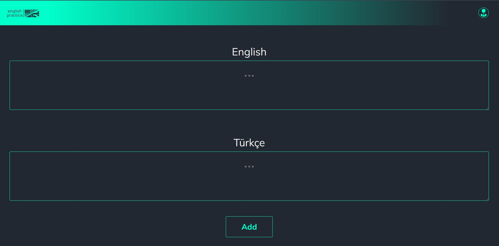
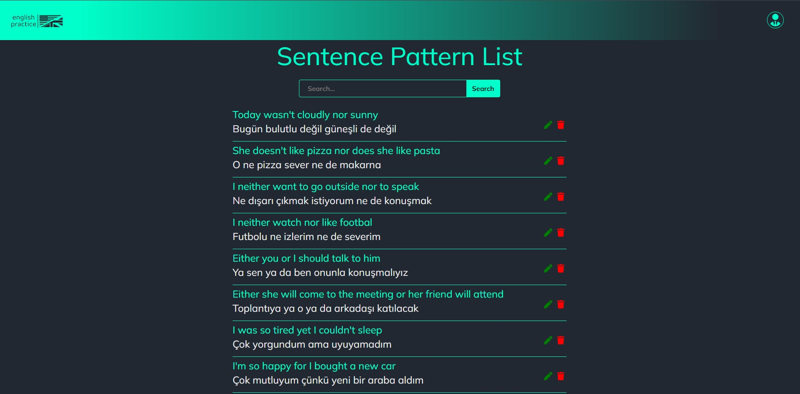
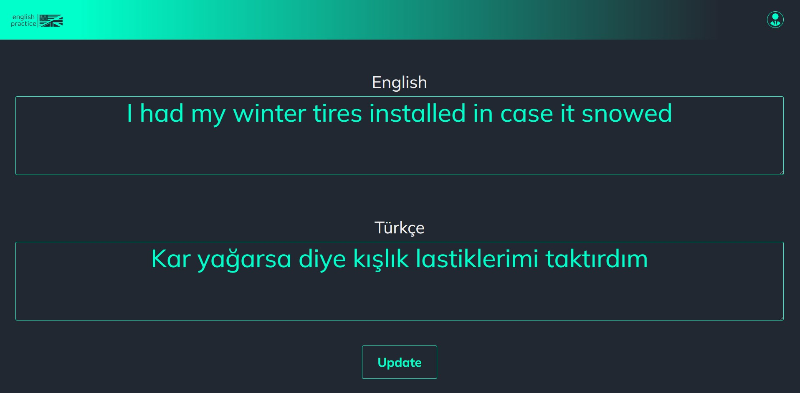

🚀 React ve Typescript ile geliştirdiğim İngilizce egzersiz uygulaması 🎉  
🔗 Uygulamayı görmek ve denemek için [buraya tıklayabilirsiniz](https://englishpracticeenglishpractice.netlify.app/). 
📚 Bu uygulama, kullanıcıların sözlük, kelime ve cümle kalıbı egzersizleri yapmasına olanak tanırken aynı zamanda yeni kelimeler ve cümle yapıları ekleyebilme özgürlüğü sunuyor.  
🔍 JSON sunucusu faydalanarak, projenin içindeki db.json dosyasından verileri sorunsuz bir şekilde API olarak entegre ettim, böylelikle veri alımını sorunsuz hale getirdim. İstekleri Axios mükemmel bir şekilde yönettim. 
🔄 State management için ContextApi kullanarak verileri yönettim, bu da uygulamanın verimliliğini artırdı ve kod karmaşıklığını azalttı. 
💼 Kelimeler ve cümlelerin listelenmesinde performansı artırmak için React-Virtuoso kullanımını tercih ettim, böylece uygulama daha hızlı ve akıcı bir deneyim sunuyor. 
💅 Ek olarak, SASS uygulamanın estetiğini artırmada kritik bir rol oynadı, görsel olarak çekici ve kullanıcı dostu bir deneyim sunarak.

